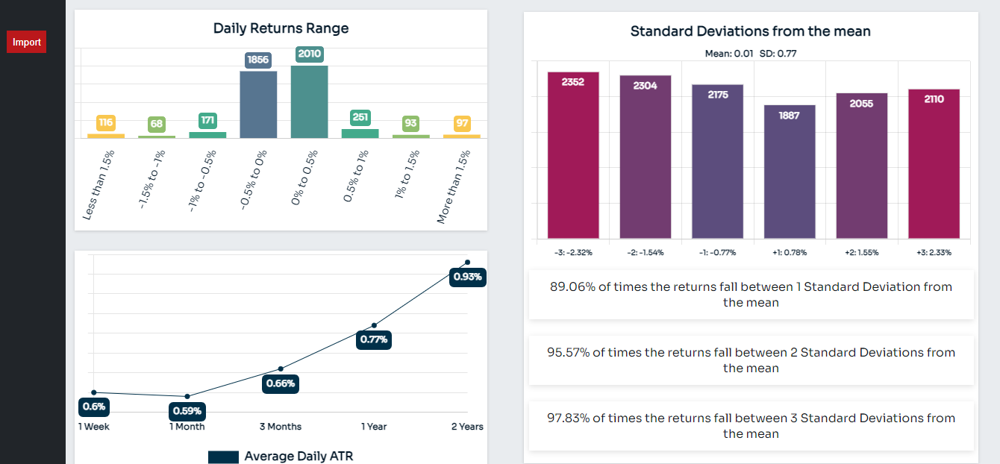

# Volme
A calculator used to find the ATR, Standard Deviations from the mean and the Distribution and display the findings through Chartjs visualizations

## General Info
A React app that calculates imported CSV Open, Low, High and Close data to find the ATR, The Distribution and STDs from the mean of a financial instrument and display the findings through React Chart visualizations.





## Technologies
* React: 17.0.2
* Sass: 1.35.2
* Ts-loader: 6.0.0
* Sass-loader: 12.1.0
* Webpack: 5.45.1
* Typescript: 4.3.5
* chart.js: 3.5.0
* react-chartjs-2: 3.0.4


## Setup 
To run this project, install it locally using npm:
```
$ cd ../Volme
$ npm install
$ npm run dev
